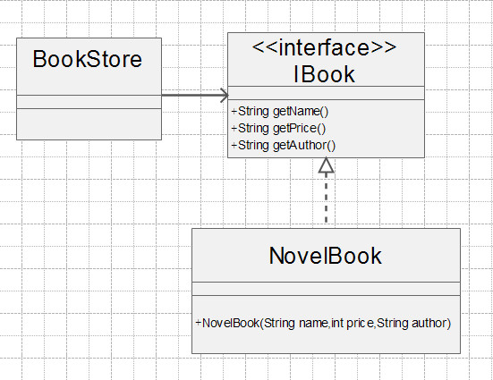
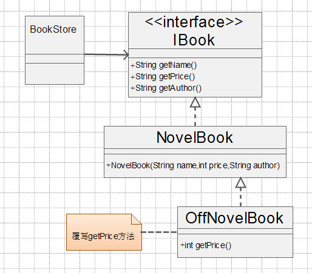

# 03-开闭原则

[TOC]

## 1. 定义

>  开闭原则（Open Closed Principle，OCP）由勃兰特·梅耶（Bertrand Meyer）提出，他在 1988 年的著作《面向对象软件构造》（Object Oriented Software Construction）中提出：软件实体应当对扩展开放，对修改关闭（Software entities should be open for extension，but closed for modification），这就是开闭原则的经典定义。

# 2.理解

任何软件都需要面临一个很重要的问题，即它们的需求会随时间的推移而发生变化。

- 当软件系统需要面对新的需求时，应该尽量保证系统的设计框架是稳定的
- 如果一个软件设计符合开闭原则，那么可以非常方便地对系统进行拓展。而且在修改的时候无需修改现有代码，使得代码具有良好的稳定性和延续性。

其含义是说一个软件实体应该通过扩展来实现变化，而不是通过修改已有的代码来实现变化的。那什么是软件实体呢？软件实体包括以下几个部分：

- 项目或软件产品中按照一定的逻辑规则划分的模块
- 抽象和类
- 方法

# 案例

以书店销售书籍为例，其类图如下：




书籍接口：

```java
public interface IBook{
  public String getName();
  public String getPrice();
  public String getAuthor();
}
```

小说类书籍：

```java
public class NovelBook implements IBook{
   private String name;
   private int price;
   private String author;

   public NovelBook(String name,int price,String author){
     this.name = name;
     this.price = price;
     this.author = author;
   }

   public String getAutor(){
     return this.author;
   }

   public String getName(){
     return this.name;
   }  

   public int getPrice(){
     return this.price;
   } 
}
```

Client类：

```java
public class Client{
   public static void main(Strings[] args){
     IBook novel = new NovelBook("笑傲江湖",100,"金庸");
     System.out.println("书籍名字："+novel.getName()+"书籍作者："+novel.getAuthor()+"书籍价格："+novel.getPrice());
   }

}
```

项目投产生，书籍正常销售，但是我们经常因为各种原因，要打折来销售书籍，这是一个变化，我们要如何应对这样一个需求变化呢？


我们有下面三种方法可以解决此问题：

- 修改接口
  在IBook接口中，增加一个方法getOffPrice(),专门用于进行打折处理，所有的实现类实现此方法。但是这样的一个修改方式，实现类NovelBook要修改，同时IBook接口应该是稳定且可靠，不应该经常发生改变，否则接口作为契约的作用就失去了。因此，此方案否定。
- 修改实现类
  修改NovelBook类的方法，直接在getPrice()方法中实现打折处理。此方法是有问题的，例如我们如果getPrice()方法中只需要读取书籍的打折前的价格呢？这不是有问题吗？当然我们也可以再增加getOffPrice()方法，这也是可以实现其需求，但是这就有二个读取价格的方法，因此，该方案也不是一个最优方案。
- 通过扩展实现变化
  我们可以增加一个子类OffNovelBook,覆写getPrice方法。此方法修改少，对现有的代码没有影响，风险少，是个好办法。
  下面是修改后的类图：





打折类：

```
public class OffNovelBook extends NovelBook{

   public OffNovelBook(String name,int price,String author){
      super(name,price,author);
   }

   //覆写价格方法，当价格大于40，就打8析，其他价格就打9析
   public int getPrice(){
     if(this.price > 40){
        return this.price * 0.8;
     }else{
        return this.price * 0.9;
     }     
   } 
}
```

现在打折销售开发完成了，我们只是增加了一个OffNovelBook类，我们修改的代码都是高层次的模块，没有修改底层模块，代码改变量少，可以有效的防止风险的扩散。

我们可以把变化归纳为二种类型：

- 逻辑变化
  只变化了一个逻辑，而不涉及其他模块，比如一个算法是a*b*c，现在需要修改为a+b+c，可以直接通过修改原有类中的方法的方式来完成，前提条件是所有依赖或关联类都按照相同的逻辑处理
- 子模块变化
  一人模块变化，会对其它的模块产生影响，特别是一个低层次的模块变化必然引起高层模块的变化，因此在通过扩展完成变化。


# 为什么使用开闭原则

第一：开闭原则非常有名，只要是面向对象编程，在开发时都会强调开闭原则

第二：开闭原则是最基础的设计原则，其它的五个设计原则都是开闭原则的具体形态，也就是说其它的五个设计原则是指导设计的工具和方法，而开闭原则才是其精神领袖。依照java语言的称谓，开闭原则是抽象类，而其它的五个原则是具体的实现类。

第三：开闭原则可以提高复用性

在面向对象的设计中，所有的逻辑都是从原子逻辑组合而来，不是在一个类中独立实现一个业务逻辑。只有这样的代码才可以复用，粒度越小，被复用的可能性越大。那为什么要复用呢？减少代码的重复，避免相同的逻辑分散在多个角落，减少维护人员的工作量。那怎么才能提高复用率呢？缩小逻辑粒度，直到一个逻辑不可以分为止。

第四：开闭原则可以提高维护性

一款软件量产后，维护人员的工作不仅仅对数据进行维护，还可能要对程序进行扩展，维护人员最乐意的事是扩展一个类，而不是修改一个类。让维护人员读懂原有代码，再进行修改，是一件非常痛苦的事情，不要让他在原有的代码海洋中游荡后再修改，那是对维护人员的折磨和摧残。

第五：面向对象开发的要求

万物皆对象，我们要把所有的事物抽象成对象，然后针对对象进行操作，但是万物皆发展变化，有变化就要有策略去应对，怎么快速应对呢？这就需要在设计之初考虑到所有可能变化的因素，然后留下接口，等待“可能”转变为“现实”。

# 如何使用开闭原则

第一：**抽象约束**

抽象是对一组事物的通用描述，没有具体的实现，也就表示它可以有非常多的可能性，可以跟随需求的变化而变化。因此，通过接口或抽象类可以约束一组可能变化的行为，并且能够实现对扩展开放，其包含三层含义：

- 通过接口或抽象类约束扩散，对扩展进行边界限定，不允许出现在接口或抽象类中不存在的public方法。
- 参数类型，引用对象尽量使用接口或抽象类，而不是实现类，这主要是实现里氏替换原则的一个要求
- 抽象层尽量保持稳定，一旦确定就不要修改


第二：元数据(metadata)控件模块行为

编程是一个很苦很累的活，那怎么才能减轻压力呢？答案是尽量使用元数据来控制程序的行为，减少重复开发。什么是元数据？用来描述环境和数据的数据，通俗的说就是配置参数，参数可以从文件中获得，也可以从数据库中获得。


第三：制定项目章程

在一个团队中，建立项目章程是非常重要的，因为章程是所有人员都必须遵守的约定，对项目来说，约定优于配置。这比通过接口或抽象类进行约束效率更高，而扩展性一点也没有减少。


第四：封装变化

对变化封装包含两层含义：

(1)将相同的变化封装到一个接口或抽象类中

(2)将不同的变化封装到不同的接口或抽象类中，不应该有两个不同的变化出现在同一个接口或抽象类中。

封装变化，也就是受保护的变化，找出预计有变化或不稳定的点，我们为这些变化点创建稳定的接口。