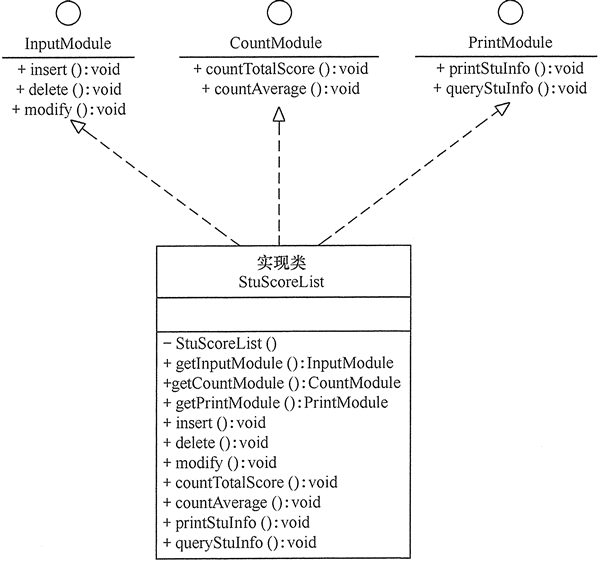

# 05-接口隔离原则.md

[TOC]

## 1. 定义

> Interface Segregation Principle

客户端不应该依赖它不需要的接口，即一个类对另一个类的依赖应该建立在最小的接口上

- 当一个接口太大时，需要将它分割成一些更细小的接口，使用该接口的客户端仅需要只调用与之相关的方法即可。

- 每一个接口应该承担一种相对独立的角色，不该干的事不干，该干的事都干。

- 设计接口的继承结构时，应该注重接接口的隔离原则。

## 2. 理解

接口对于Java开发者来说都不陌生，它几乎存在于每一个Java程序中，是抽象的代名词。在讲接口隔离原则之前，先说说接口，接口分为以下两种：

- **实例接口(Object Interface)：** 在Java中声明一个类，然后用new关键字产生一个实例，是对一个类型的事物的描述，这就是一种接口。或许我们乍一看会有点懵，怎么和我们原来学习的接口不一样呢，其实我们这样想，我们都知道，在Java中有一个Class类，表示正在运行的类和接口，换句话说每一个正在运行时的类或接口都是Class类的对象，这是一种向上的抽象。接口是一种更为抽象的定义，类是一类相同事物的描述集合，那为什么不可以抽象为一个接口呢？
- **类接口(Class Interface)：** 这就是我们经常使用的用interface定义的接口

注意：接口隔离原则中所说的接口并不是狭意的在Java中用interface定义的接口，而是一种更为宽泛的概念，可以是接口，抽象类或者实体类。

其实通俗来理解就是，不要在一个接口里面放很多的方法，这样会显得这个类很臃肿不堪。接口应该尽量细化，一个接口对应一个功能模块，同时接口里面的方法应该尽可能的少，使接口更加轻便灵活。或许看到接口隔离原则这样的定义很多人会觉得和单一职责原则很像，但是这两个原则还是有着很鲜明的区别。接口隔离原则和单一职责原则的审视角度是不同的，单一职责原则要求类和接口职责单一，注重的是职责，是业务逻辑上的划分，而接口隔离原则要求方法要尽可能的少，是在接口设计上的考虑。例如一个接口的职责包含10个方法，这10个方法都放在一个接口中，并且提供给多个模块访问，各个模块按照规定的权限来访问，并规定了“不使用的方法不能访问”，这样的设计是不符合接口隔离原则的，接口隔离原则要求“尽量使用多个专门的接口”，这里专门的接口就是指提供给每个模块的都应该是单一接口(即每一个模块对应一个接口)，而不是建立一个庞大臃肿的接口来容纳所有的客户端访问。

## 3. 接口隔离原则的实现方法

在具体应用接口隔离原则时，应该根据以下几个规则来衡量。

- 接口尽量小，但是要有限度。一个接口只服务于一个子模块或业务逻辑。
- 为依赖接口的类定制服务。只提供调用者需要的方法，屏蔽不需要的方法。
- 了解环境，拒绝盲从。每个项目或产品都有选定的环境因素，环境不同，接口拆分的标准就不同深入了解业务逻辑。
- 提高内聚，减少对外交互。使接口用最少的方法去完成最多的事情。


下面以学生成绩管理程序为例介绍接口隔离原则的应用。

【例1】学生成绩管理程序。

分析：学生成绩管理程序一般包含插入成绩、删除成绩、修改成绩、计算总分、计算均分、打印成绩信息、査询成绩信息等功能，如果将这些功能全部放到一个接口中显然不太合理，正确的做法是将它们分别放在输入模块、统计模块和打印模块等 3 个模块中，其类图如图 1 所示。


图1 学生成绩管理程序的类图

程序代码如下：

```java
package principle;

public class ISPtest {
    public static void main(String[] args) {
        InputModule input = StuScoreList.getInputModule();
        CountModule count = StuScoreList.getCountModule();
        PrintModule print = StuScoreList.getPrintModule();
        input.insert();
        count.countTotalScore();
        print.printStuInfo();
        //print.delete();
    }
}

//输入模块接口
interface InputModule {
    void insert();

    void delete();

    void modify();
}

//统计模块接口
interface CountModule {
    void countTotalScore();

    void countAverage();
}

//打印模块接口
interface PrintModule {
    void printStuInfo();

    void queryStuInfo();
}

//实现类
class StuScoreList implements InputModule, CountModule, PrintModule {
    private StuScoreList() {
    }

    public static InputModule getInputModule() {
        return (InputModule) new StuScoreList();
    }

    public static CountModule getCountModule() {
        return (CountModule) new StuScoreList();
    }

    public static PrintModule getPrintModule() {
        return (PrintModule) new StuScoreList();
    }

    public void insert() {
        System.out.println("输入模块的insert()方法被调用！");
    }

    public void delete() {
        System.out.println("输入模块的delete()方法被调用！");
    }

    public void modify() {
        System.out.println("输入模块的modify()方法被调用！");
    }

    public void countTotalScore() {
        System.out.println("统计模块的countTotalScore()方法被调用！");
    }

    public void countAverage() {
        System.out.println("统计模块的countAverage()方法被调用！");
    }

    public void printStuInfo() {
        System.out.println("打印模块的printStuInfo()方法被调用！");
    }

    public void queryStuInfo() {
        System.out.println("打印模块的queryStuInfo()方法被调用！");
    }
}
```

程序的运行结果如下：

```
输入模块的insert()方法被调用！
统计模块的countTotalScore()方法被调用！
打印模块的printStuInfo()方法被调用！
```

## 4.ISP的几个使用原则

- **根据接口隔离原则拆分接口时，首先必须满足单一职责原则：** 没有哪个设计可以十全十美的考虑到所有的设计原则，有些设计原则之间就可能出现冲突，就如同单一职责原则和接口隔离原则，一个考虑的是接口的职责的单一性，一个考虑的是方法设计的专业性(尽可能的少)，必然是会出现冲突。在出现冲突时，尽量以单一职责为主，当然这也要考虑具体的情况。
- **提高高内聚：** 提高接口，类，模块的处理能力，减少对外的交互。比如你给杀手提交了一个订单，要求他在一周之内杀一个人，一周后杀手完成了任务，这种不讲条件完成任务的表现就是高内聚。具体来说就是：要求在接口中尽量少公布public方法，接口是对外的承诺，承诺越少对系统的开发越有利，变更的风险就越小，也有利于降低成本。
- **定制服务：** 单独为一个个体提供优良服务(只提供访问者需要的方法)。
- **接口设计要有限度：** 根据经验判断

## 5. 接口隔离原则的优点

接口隔离原则是为了约束接口、降低类对接口的依赖性，遵循接口隔离原则有以下 5 个优点。

1. 将臃肿庞大的接口分解为多个粒度小的接口，可以预防外来变更的扩散，提高系统的灵活性和可维护性。
2. 接口隔离提高了系统的内聚性，减少了对外交互，降低了系统的耦合性。
3. 如果接口的粒度大小定义合理，能够保证系统的稳定性；但是，如果定义过小，则会造成接口数量过多，使设计复杂化；如果定义太大，灵活性降低，无法提供定制服务，给整体项目带来无法预料的风险。
4. 使用多个专门的接口还能够体现对象的层次，因为可以通过接口的继承，实现对总接口的定义。
5. 能减少项目工程中的代码冗余。过大的大接口里面通常放置许多不用的方法，当实现这个接口的时候，被迫设计冗余的代码。

