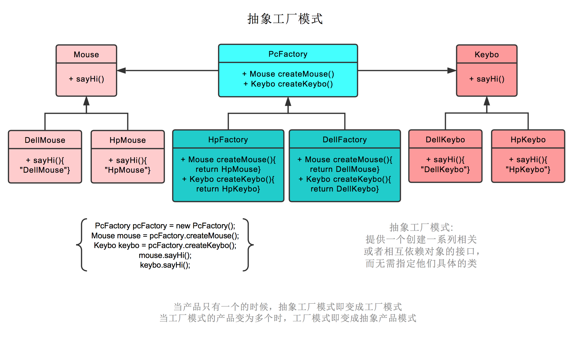

# 02-抽象工厂(Abstract Factory Pattern)

[TOC]

## 定义与特点

抽象工厂（AbstractFactory）模式的定义：是一种为访问类提供一个创建一组相关或相互依赖对象的接口，且访问类无须指定所要产品的具体类就能得到同族的不同等级的产品的模式结构。

抽象工厂模式是工厂方法模式的升级版本，工厂方法模式只生产一个等级的产品，而抽象工厂模式可生产多个等级的产品。

使用抽象工厂模式一般要满足以下条件。

- 系统中有多个产品族，每个具体工厂创建同一族但属于不同等级结构的产品。
- 系统一次只可能消费其中某一族产品，即同族的产品一起使用。

抽象工厂模式除了具有工厂方法模式的优点外，其他主要优点如下。

- 可以在类的内部对产品族中相关联的多等级产品共同管理，而不必专门引入多个新的类来进行管理。
- 当需要产品族时，抽象工厂可以保证客户端始终只使用同一个产品的产品组。
- 抽象工厂增强了程序的可扩展性，当增加一个新的产品族时，不需要修改原代码，满足开闭原则。

其缺点是：当产品族中需要增加一个新的产品时，所有的工厂类都需要进行修改。增加了系统的抽象性和理解难度。

## 模式的结构与实现

抽象工厂模式同工厂方法模式一样，也是由抽象工厂、具体工厂、抽象产品和具体产品等 4 个要素构成，但抽象工厂中方法个数不同，抽象产品的个数也不同。现在我们来分析其基本结构和实现方法。

### 1. 模式的结构

抽象工厂模式的主要角色如下。

1. 抽象工厂（Abstract Factory）：提供了创建产品的接口，它包含多个创建产品的方法 newProduct()，可以创建多个不同等级的产品。
2. 具体工厂（Concrete Factory）：主要是实现抽象工厂中的多个抽象方法，完成具体产品的创建。
3. 抽象产品（Product）：定义了产品的规范，描述了产品的主要特性和功能，抽象工厂模式有多个抽象产品。
4. 具体产品（ConcreteProduct）：实现了抽象产品角色所定义的接口，由具体工厂来创建，它同具体工厂之间是多对一的关系。

抽象工厂模式的结构图如图 2 所示。

## 

## 新增一个工厂

在抽象工厂模式中，假设我们需要增加一个工厂 

假设我们增加华硕工厂，则我们需要增加华硕工厂，和戴尔工厂一样，继承 PC 厂商。之后创建华硕鼠标，继承鼠标类。创建华硕键盘，继承键盘类即可。

### UML

## 增加一个产品 

假设我们增加耳麦这个产品，则首先我们需要增加耳麦这个父类，再加上戴尔耳麦，惠普耳麦这两个子类。

之后在PC厂商这个父类中，增加生产耳麦的接口。最后在戴尔工厂，惠普工厂这两个类中，分别实现生产戴尔耳麦，惠普耳麦的功能。 以上。

## UML

**优点**：当一个产品族中的多个对象被设计成一起工作时，它能保证客户端始终只使用同一个产品族中的对象。

**缺点**：产品族扩展非常困难，要增加一个系列的某一产品，既要在抽象的 Creator 里加代码，又要在具体的里面加代码

抽象工厂并不符合开闭原则,但是拓展性特别强,强调一系列相关的产品对象(属于同一产品族)一起使用创建对象需要大量的重复代码

提供一个产品类的库,所有的产品以同样的接口出现,从而使客户端不依赖于具体实现

## 模式的应用场景

抽象工厂模式最早的应用是用于创建属于不同操作系统的视窗构件。如 [Java](http://c.biancheng.net/java/) 的 AWT 中的 Button 和 Text 等构件在 Windows 和 UNIX 中的本地实现是不同的。

抽象工厂模式通常适用于以下场景：

1. 当需要创建的对象是一系列相互关联或相互依赖的产品族时，如电器工厂中的电视机、洗衣机、空调等。
2. 系统中有多个产品族，但每次只使用其中的某一族产品。如有人只喜欢穿某一个品牌的衣服和鞋。
3. 系统中提供了产品的类库，且所有产品的接口相同，客户端不依赖产品实例的创建细节和内部结构。

## 模式的扩展

抽象工厂模式的扩展有一定的“开闭原则”倾斜性：

1. 当增加一个新的产品族时只需增加一个新的具体工厂，不需要修改原代码，满足开闭原则。
2. 当产品族中需要增加一个新种类的产品时，则所有的工厂类都需要进行修改，不满足开闭原则。

另一方面，当系统中只存在一个等级结构的产品时，抽象工厂模式将退化到工厂方法模式。