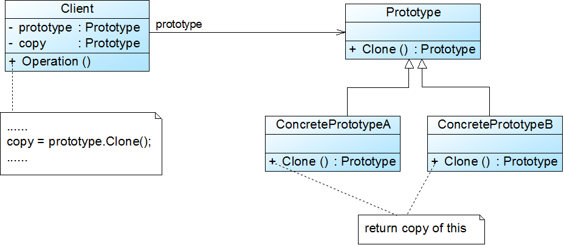
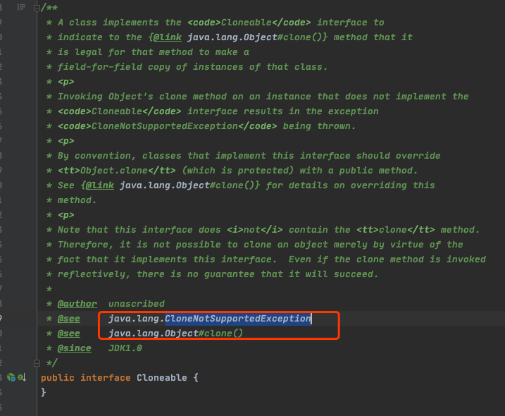

# 04-原型模式

[TOC]

## 原型模式定义

> 使用原型实例指定待创建对象的类型并且通过复制这个原型来创建新的对象

## 理解

- 原型模式用于于创建重复的对象，同时又能保证性能。

- 当一个对象需要在一个高代价的数据库操作后被创建,我们可以缓存该对象,下一个请求时返回它的克隆(一般是基于二进制流的复制),在需要的时候更新数据库,以此来减少数据库调用

## 注意事项

原型模式通过拷贝一个现有对象生成新的对象,浅拷贝实现 `Cloneable`接口,重写,深拷贝是通过实现`Serializable`读取二进制流

## 使用场景

- 创建对象成本较大(例如,初始化时间长,占用 CPU多,或者占用网络资源太多需要优化资源)
- 创建一个对选哪个需要繁琐的数据准备或者访问权限等等
- 系统中大量使用该对象,且各个调用者都需要给它的属性重新赋值

- 一般与工厂方法模式出现,通过 clone 方法创建一个对象

## UML



- Prototype(抽象原型类)：声明克隆方法的接口，是所有具体原型类的公共父类，它可是抽象类也可以是接口，甚至可以是具体实现类。
- ConcretePrototype(具体原型类)：它实现抽象原型类中声明的克隆方法，在克隆方法中返回自己的一个克隆对象。
- Client(客户端)：在客户类中，让一个原型对象克隆自身从而创建一个新的对象。

```
class ConcretePrototype implements Cloneable
{
    public Prototype  clone()
    {
      Object object = null;
      try {
         object = super.clone();
      } catch (CloneNotSupportedException exception) {
         System.err.println("Not support cloneable");
      }
      return (Prototype )object;
    }
}
```

## 实例

形状抽象类,实现 Cloneable 接口

```java
public abstract class Shape implements Cloneable {

    private String id;
    protected String type;

    abstract void draw();

    public String getType() {
        return type;
    }

    public String getId() {
        return id;
    }

    public void setId(String id) {
        this.id = id;
    }

    @Override
    public Object clone() {
        Object clone = null;
        try {
            clone = super.clone();
        } catch (CloneNotSupportedException e) {
            e.printStackTrace();
        }
        return clone;
    }
}
```

#### Shape 实现类 Circle

```java
public class Circle extends Shape {

    public Circle(){
        type = "Circle";
    }

    @Override
    public void draw() {
        System.out.println("Inside Circle::draw() method.");
    }
}
```

#### Shape 实现类 Rectangle

```java
public class Rectangle extends Shape {

    public Rectangle(){
        type = "Rectangle";
    }

    @Override
    public void draw() {
        System.out.println("Inside Rectangle::draw() method.");
    }
}

```

#### Shape 实现类 Square

```java
public class Square extends Shape {

    public Square(){
        type = "Square";
    }

    @Override
    public void draw() {
        System.out.println("Inside Square::draw() method.");
    }
}

```

#### Shape 缓存

```java
public class ShapeCache {

    private static Hashtable<String, Shape> shapeMap
            = new Hashtable<String, Shape>();

    public static Shape getShape(String shapeId) {
        Shape cachedShape = shapeMap.get(shapeId);
        return (Shape) cachedShape.clone();
    }

    // 对每种形状都运行数据库查询，并创建该形状
    // shapeMap.put(shapeKey, shape);
    // 例如，我们要添加三种形状
    public static void loadCache() {
        Circle circle = new Circle();
        circle.setId("1");
        shapeMap.put(circle.getId(),circle);

        Square square = new Square();
        square.setId("2");
        shapeMap.put(square.getId(),square);

        Rectangle rectangle = new Rectangle();
        rectangle.setId("3");
        shapeMap.put(rectangle.getId(),rectangle);
    }
}
```

#### 测试类

```java
public class Test {
    public static void main(String[] args) {
        ShapeCache.loadCache();

        Shape clonedShape = ShapeCache.getShape("1");
        System.out.println("Shape : " + clonedShape.getType());

        Shape clonedShape2 = ShapeCache.getShape("2");
        System.out.println("Shape : " + clonedShape2.getType());

        Shape clonedShape3 = ShapeCache.getShape("3");
        System.out.println("Shape : " + clonedShape3.getType());
    }
}
```

#### 运行结果

```
Shape : Circle
Shape : Square
Shape : Rectangle
```

## 使用原型模式解决实际的问题

### 分析JDK浅克隆API带来的问题

在 Java 提供的 API 中, 不需要手动创建抽象原型接口,因为 Java 已经内置了 Cloneable 抽象原型接口, 自定义的类型只需要实现该接口并重写 Object.clone 方法就可以完成对本类的复制

#### Clonable 是一个空接口

通过查看 JDK 源码我们可以发现,其实 Cloneable 就是一个空接口, 



Java 之所以提供这个接口时因为在运行时通知 Java 虚拟机是否可以安全地使用 clone 方法, 如果没有实现 CloneAble 接口,则调用的时候会抛出 CloneNotSupportedException

一般情况下,想要调用 clone 方法, 则需要满足以下条件

- (必须)**克隆对象与原型对象不是同一个对象 (**深拷贝**)** ,  对于任何对象 Object o1, 都有 o1.clone()  != o1
- (必须)**克隆对象与原型对象的类型一致** , 也就是 对于任何对象 Object o1, 都有 o1.clone().getClass() == o.getClass() 

- (可选) 如果对象 o 的 equals 定义恰当, 则 o.clone().equals(o) 应当成立

## 浅拷贝

super.clone() 方法直接从堆内存中以二进制流的方式进行复制,重新分配一个内存块,因此其实效率很高,由于 super.clone() 方法基于内存复制,因此不会调用对象的**构造函数,也就是不需要经历初始化过程**

```java
@Data
public class ConcretePrototype implements Cloneable {

    private int age;
    private String name;
    private List<String> hobbies;

    @Override
    public ConcretePrototype clone() {
        try {
            return (ConcretePrototype)super.clone();
        } catch (CloneNotSupportedException e) {
            e.printStackTrace();
            return null;
        }
    }
}
```

但是有一个致命的问题:

类中存在引用对象属性,则原型对象与克隆对象的该属性会指向同一个对象的引用

即 **拷贝前对象.hobbies = 拷贝后对象.hobbies**

## 深拷贝

使用序列化技术实现深克隆,Spring中的BeanDefiniation就是深拷贝

```java
@Data
public class ConcretePrototype implements Cloneable,Serializable {

    private int age;
    private String name;
    private List<String> hobbies;

    @Override
    public ConcretePrototype clone() {
        try {
            return (ConcretePrototype)super.clone();
        } catch (CloneNotSupportedException e) {
            e.printStackTrace();
            return null;
        }
    }

    public ConcretePrototype deepCloneHobbies(){
        try {
            ConcretePrototype result = (ConcretePrototype)super.clone();
            result.hobbies = (List)((ArrayList)result.hobbies).clone();
            return result;
        } catch (CloneNotSupportedException e) {
            e.printStackTrace();
            return null;
        }
    }

    public ConcretePrototype deepClone(){
        try {
            ByteArrayOutputStream bos = new ByteArrayOutputStream();
            ObjectOutputStream oos = new ObjectOutputStream(bos);
            oos.writeObject(this);

            ByteArrayInputStream bis = new ByteArrayInputStream(bos.toByteArray());
            ObjectInputStream ois = new ObjectInputStream(bis);

            return (ConcretePrototype)ois.readObject();
        }catch (Exception e){
            e.printStackTrace();
            return null;
        }
    }
}

```

## 原型模式的优缺点

优点

- Java 自带的原型模式基于内存二进制流的复制,在性能上比直接 new 一个对象更加优良
- 可以使用深拷贝的方式白村对象的状态,使用原型模式将对象复制一份,并将其状态保存起来,简化对象的创建过程,以便在需要的时候使用

原型模式的缺点

- 需要为每一个类都配置一个 clone 方法
- clone 方法位于类的内部,当对已有代码进行改造时. 需要修改代码,违背了考妣原则
- 实现深克隆时,需要编写较为复杂的代码,而且当时对象之间存在多重嵌套引用时,为了实现深拷贝,需要对每一层对象实现深拷贝