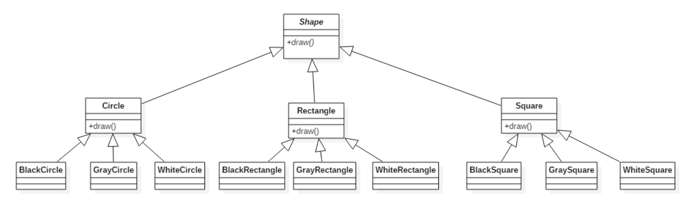
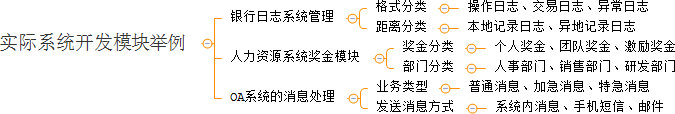

# 02-桥接模式

[TOC]

## 1. 概述

现在有一个需求，需要创建不同的图形，并且每个图形都有可能会有不同的颜色。我们可以利用继承的方式来设计类的关系：



### 传统方案问题分析

- 拓展性问题（类爆炸）
- 违反单一职责原则

我们可以发现有很多的类，假如我们再增加一个形状或再增加一种颜色，就需要创建更多的类。

试想，在一个有多种可能会变化的维度的系统中，用继承方式会造成类爆炸，扩展起来不灵活。每次在一个维度上新增一个具体实现都要增加多个子类。为了更加灵活的设计系统，我们此时可以考虑使用桥接模式。

**定义：**

​	将抽象与实现分离，使它们可以独立变化。它是用组合关系代替继承关系来实现，从而降低了抽象和实现这两个可变维度的耦合度。

Bridge模式基于类的最小设计原则，通过使用封装，聚合及继承等行为让不同的类承担不同的职责，它的主要特点是把抽象与行为实现分离开来，从而可以保持各部分的独立性以及应对他们的功能扩展。

## 2. 结构


桥接（Bridge）模式包含以下主要角色：

* 抽象化（Abstraction）角色 ：定义抽象类，并包含一个对实现化对象的引用。
* 扩展抽象化（Refined  Abstraction）角色 ：是抽象化角色的子类，实现父类中的业务方法，并通过组合关系调用实现化角色中的业务方法。
* 实现化（Implementor）角色 ：定义实现化角色的接口，供扩展抽象化角色调用。
* 具体实现化（Concrete Implementor）角色 ：给出实现化角色接口的具体实现。

## 3. 案例

【例】视频播放器

需要开发一个跨平台视频播放器，可以在不同操作系统平台（如Windows、Mac、Linux等）上播放多种格式的视频文件，常见的视频格式包括RMVB、AVI、WMV等。该播放器包含了两个维度，适合使用桥接模式。

类图如下：


代码如下：

```java
//视频文件
public interface VideoFile {
    void decode(String fileName);
}

//avi文件
public class AVIFile implements VideoFile {
    public void decode(String fileName) {
        System.out.println("avi视频文件："+ fileName);
    }
}

//rmvb文件
public class REVBBFile implements VideoFile {

    public void decode(String fileName) {
        System.out.println("rmvb文件：" + fileName);
    }
}

//操作系统版本
public abstract class OperatingSystemVersion {

    protected VideoFile videoFile;

    public OperatingSystemVersion(VideoFile videoFile) {
        this.videoFile = videoFile;
    }

    public abstract void play(String fileName);
}

//Windows版本
public class Windows extends OperatingSystem {

    public Windows(VideoFile videoFile) {
        super(videoFile);
    }

    public void play(String fileName) {
        videoFile.decode(fileName);
    }
}

//mac版本
public class Mac extends OperatingSystemVersion {

    public Mac(VideoFile videoFile) {
        super(videoFile);
    }

    public void play(String fileName) {
		videoFile.decode(fileName);
    }
}

//测试类
public class Client {
    public static void main(String[] args) {
        OperatingSystem os = new Windows(new AVIFile());
        os.play("战狼3");
    }
}
```

**好处：**

* 桥接模式提高了系统的可扩充性，在两个变化维度中任意扩展一个维度，都不需要修改原有系统。

  如：如果现在还有一种视频文件类型wmv，我们只需要再定义一个类实现VideoFile接口即可，其他类不需要发生变化。

* 实现细节对客户透明

## 4. 使用场景

当一个类内部具备两种或多种变化维度时，使用桥接模式可以解耦这些变化的维度，使高层代码架构稳定。

桥接模式通常适用于以下场景。

1. 当一个类存在两个独立变化的维度，且这两个维度都需要进行扩展时。
2. 当一个系统不希望使用继承或因为多层次继承导致系统类的个数急剧增加时。
3. 当一个系统需要在构件的抽象化角色和具体化角色之间增加更多的灵活性时。


桥接模式的一个常见使用场景就是替换继承。我们知道，继承拥有很多优点，比如，抽象、封装、多态等，父类封装共性，子类实现特性。继承可以很好的实现代码复用（封装）的功能，但这也是继承的一大缺点。

因为父类拥有的方法，子类也会继承得到，无论子类需不需要，这说明继承具备强侵入性（父类代码侵入子类），同时会导致子类臃肿。因此，在[设计模式](http://c.biancheng.net/design_pattern/)中，有一个原则为优先使用组合/聚合，而不是继承。



很多时候，我们分不清该使用继承还是组合/聚合或其他方式等，其实可以从现实语义进行思考。因为软件最终还是提供给现实生活中的人使用的，是服务于人类社会的，软件是具备现实场景的。当我们从纯代码角度无法看清问题时，现实角度可能会提供更加开阔的思路。

## 5. 进阶阅读

- 桥接模式在JDBC中的应用
- 桥接模式设计复杂消息系统
