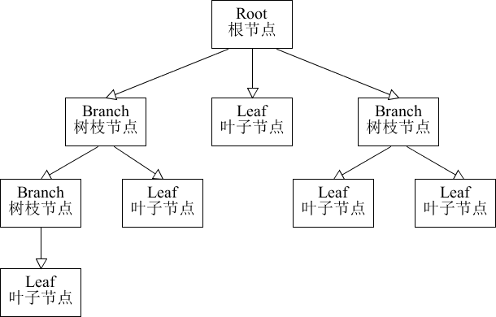

# 03-组合模式

[TOC]

## 1. 概述


对于这个图片肯定会非常熟悉，上图我们可以看做是一个文件系统，对于这样的结构我们称之为树形结构。在树形结构中可以通过调用某个方法来遍历整个树，当我们找到某个叶子节点后，就可以对叶子节点进行相关的操作。可以将这颗树理解成一个大的容器，容器里面包含很多的成员对象，这些成员对象即可是容器对象也可以是叶子对象。但是由于容器对象和叶子对象在功能上面的区别，使得我们在使用的过程中必须要区分容器对象和叶子对象，但是这样就会给客户带来不必要的麻烦，作为客户而已，它始终希望能够一致的对待容器对象和叶子对象。

**定义：**

有时又叫作整体-部分（Part-Whole）模式，它是一种将对象组合成树状的层次结构的模式，用来表示“整体-部分”的关系，使用户对单个对象和组合对象具有一致的访问性，属于结构型[设计模式](http://c.biancheng.net/design_pattern/)。

组合模式一般用来描述整体与部分的关系，它将对象组织到树形结构中，顶层的节点被称为根节点，根节点下面可以包含树枝节点和叶子节点，树枝节点下面又可以包含树枝节点和叶子节点，树形结构图如下。

组合模式一般用来描述整体与部分的关系，它将对象组织到树形结构中，顶层的节点被称为根节点，根节点下面可以包含树枝节点和叶子节点，树枝节点下面又可以包含树枝节点和叶子节点，树形结构图如下。




由上图可以看出，其实根节点和树枝节点本质上属于同一种数据类型，可以作为容器使用；而叶子节点与树枝节点在语义上不属于用一种类型。但是在组合模式中，会把树枝节点和叶子节点看作属于同一种数据类型（用统一接口定义），让它们具备一致行为。

这样，在组合模式中，整个树形结构中的对象都属于同一种类型，带来的好处就是用户不需要辨别是树枝节点还是叶子节点，可以直接进行操作，给用户的使用带来极大的便利。

组合模式的主要优点有：

1. 组合模式使得客户端代码可以一致地处理单个对象和组合对象，无须关心自己处理的是单个对象，还是组合对象，这简化了客户端代码；
2. 更容易在组合体内加入新的对象，客户端不会因为加入了新的对象而更改源代码，满足“开闭原则”；


其主要缺点是：

1. 设计较复杂，客户端需要花更多时间理清类之间的层次关系；
2. 不容易限制容器中的构件；
3. 不容易用继承的方法来增加构件的新功能；

## 2. 结构

组合模式主要包含三种角色：

* 抽象构件（Component）角色：它的主要作用是为树叶构件和树枝构件声明公共接口，并实现它们的默认行为。在透明式的组合模式中抽象构件还声明访问和管理子类的接口；在安全式的组合模式中不声明访问和管理子类的接口，管理工作由树枝构件完成。（总的抽象类或接口，定义一些通用的方法，比如新增、删除）
* 树叶构件（Leaf）角色：是组合中的叶节点对象，它没有子节点，用于继承或实现抽象构件。
* 树枝构件（Composite）角色 / 中间构件：是组合中的分支节点对象，它有子节点，用于继承和实现抽象构件。它的主要作用是存储和管理子部件，通常包含 Add()、Remove()、GetChild() 等方法。

## 3. 组合模式的分类

在使用组合模式时，根据抽象构件类的定义形式，我们可将组合模式分为透明组合模式和安全组合模式两种形式。

### 3.1 透明组合模式

在该方式中，由于抽象构件声明了所有子类中的全部方法，所以客户端无须区别树叶对象和树枝对象，对客户端来说是透明的。但其缺点是：树叶构件本来没有 Add()、Remove() 及 GetChild() 方法，却要实现它们（空实现或抛异常），这样会带来一些安全性问题。其结构图如图 1 所示。


图1 透明式的组合模式的结构图


### 3.2 安全组合模式

在该方式中，将管理子构件的方法移到树枝构件中，抽象构件和树叶构件没有对子对象的管理方法，这样就避免了上一种方式的安全性问题，但由于叶子和分支有不同的接口，客户端在调用时要知道树叶对象和树枝对象的存在，所以失去了透明性。其结构图如图 2 所示。


图2 安全式的组合模式的结构图

## 4. 案例

【例】软件菜单

如下图，我们在访问别的一些管理系统时，经常可以看到类似的菜单。一个菜单可以包含菜单项（菜单项是指不再包含其他内容的菜单条目），也可以包含带有其他菜单项的菜单，因此使用组合模式描述菜单就很恰当，我们的需求是针对一个菜单，打印出其包含的所有菜单以及菜单项的名称。


要实现该案例，我们先画出类图：


**代码实现：**

不管是菜单还是菜单项，都应该继承自统一的接口，这里姑且将这个统一的接口称为菜单组件。

```java
//菜单组件  不管是菜单还是菜单项，都应该继承该类
public abstract class MenuComponent {

    protected String name;
    protected int level;

    //添加菜单
    public void add(MenuComponent menuComponent){
        throw new UnsupportedOperationException();
    }

    //移除菜单
    public void remove(MenuComponent menuComponent){
        throw new UnsupportedOperationException();
    }

    //获取指定的子菜单
    public MenuComponent getChild(int i){
        throw new UnsupportedOperationException();
    }

    //获取菜单名称
    public String getName(){
        return name;
    }

    public void print(){
        throw new UnsupportedOperationException();
    }
}
```

这里的MenuComponent定义为抽象类，因为有一些共有的属性和行为要在该类中实现，Menu和MenuItem类就可以只覆盖自己感兴趣的方法，而不用搭理不需要或者不感兴趣的方法，举例来说，Menu类可以包含子菜单，因此需要覆盖add()、remove()、getChild()方法，但是MenuItem就不应该有这些方法。这里给出的默认实现是抛出异常，你也可以根据自己的需要改写默认实现。

```java
public class Menu extends MenuComponent {

    private List<MenuComponent> menuComponentList;

    public Menu(String name,int level){
        this.level = level;
        this.name = name;
        menuComponentList = new ArrayList<MenuComponent>();
    }

    @Override
    public void add(MenuComponent menuComponent) {
        menuComponentList.add(menuComponent);
    }

    @Override
    public void remove(MenuComponent menuComponent) {
        menuComponentList.remove(menuComponent);
    }

    @Override
    public MenuComponent getChild(int i) {
        return menuComponentList.get(i);
    }

    @Override
    public void print() {

        for (int i = 1; i < level; i++) {
            System.out.print("--");
        }
        System.out.println(name);
        for (MenuComponent menuComponent : menuComponentList) {
            menuComponent.print();
        }
    }
}
```

Menu类已经实现了除了getName方法的其他所有方法，因为Menu类具有添加菜单，移除菜单和获取子菜单的功能。

```java
public class MenuItem extends MenuComponent {

    public MenuItem(String name,int level) {
        this.name = name;
        this.level = level;
    }

    @Override
    public void print() {
        for (int i = 1; i < level; i++) {
            System.out.print("--");
        }
        System.out.println(name);
    }
}
```

MenuItem是菜单项，不能再有子菜单，所以添加菜单，移除菜单和获取子菜单的功能并不能实现。

* 透明组合模式

  透明组合模式中，抽象根节点角色中声明了所有用于管理成员对象的方法，比如在示例中 `MenuComponent` 声明了 `add`、`remove` 、`getChild` 方法，这样做的好处是确保所有的构件类都有相同的接口。透明组合模式也是组合模式的标准形式。

  透明组合模式的缺点是不够安全，因为叶子对象和容器对象在本质上是有区别的，叶子对象不可能有下一个层次的对象，即不可能包含成员对象，因此为其提供 add()、remove() 等方法是没有意义的，这在编译阶段不会出错，但在运行阶段如果调用这些方法可能会出错（如果没有提供相应的错误处理代码）

* 安全组合模式

  在安全组合模式中，在抽象构件角色中没有声明任何用于管理成员对象的方法，而是在树枝节点 `Menu` 类中声明并实现这些方法。安全组合模式的缺点是不够透明，因为叶子构件和容器构件具有不同的方法，且容器构件中那些用于管理成员对象的方法没有在抽象构件类中定义，因此客户端不能完全针对抽象编程，必须有区别地对待叶子构件和容器构件。

  

## 5. 优点

* 组合模式可以清楚地定义分层次的复杂对象，表示对象的全部或部分层次，它让客户端忽略了层次的差异，方便对整个层次结构进行控制。
* 客户端可以一致地使用一个组合结构或其中单个对象，不必关心处理的是单个对象还是整个组合结构，简化了客户端代码。
* 在组合模式中增加新的树枝节点和叶子节点都很方便，无须对现有类库进行任何修改，符合“开闭原则”。
* 组合模式为树形结构的面向对象实现提供了一种灵活的解决方案，通过叶子节点和树枝节点的递归组合，可以形成复杂的树形结构，但对树形结构的控制却非常简单。

## 6. 使用场景

组合模式正是应树形结构而生，所以组合模式的使用场景就是出现树形结构的地方。比如：文件目录显示，多级目录呈现等树形结构数据的操作。

- [《组合模式在JDK源码中的应用》]()
- [《组合模式在MyBatis源码中的应用》]()