# 04-装饰者模式

[TOC]

## 1. 概述

有一个咖啡馆，它有一套自己的订单系统，当顾客来咖啡馆的时候，可以通过订单系统来点自己想要的咖啡：

* 咖啡种类/单品咖啡：Espresso(意大利浓咖啡)、DarkRoast、LongBlack(美式咖啡)、Decaf(无因咖啡)
* 调料：Milk、Soy(豆浆)、Chocolate
* 要求在扩展新的咖啡种类时，具有良好的扩展性、改动方便、维护方便
* 使用OO的来计算不同种类咖啡的费用：客户可以点单品咖啡，也可以单品咖啡+调料组合

## 2.解决方案

### 2.1 方案1

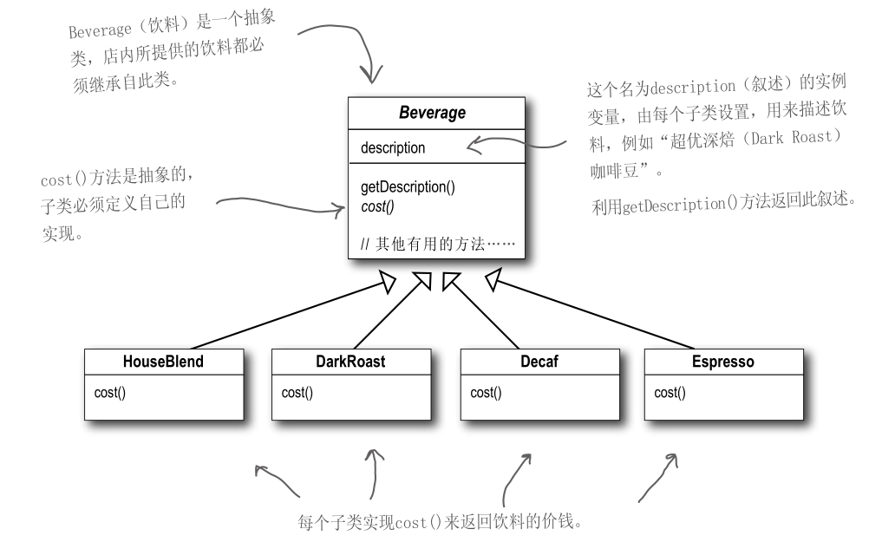

问题：这样的设计，会有很多类，当我们增加一个单品咖啡，或者一个新的调料，类的数量就会倍增，这样下去就会出现类爆炸。

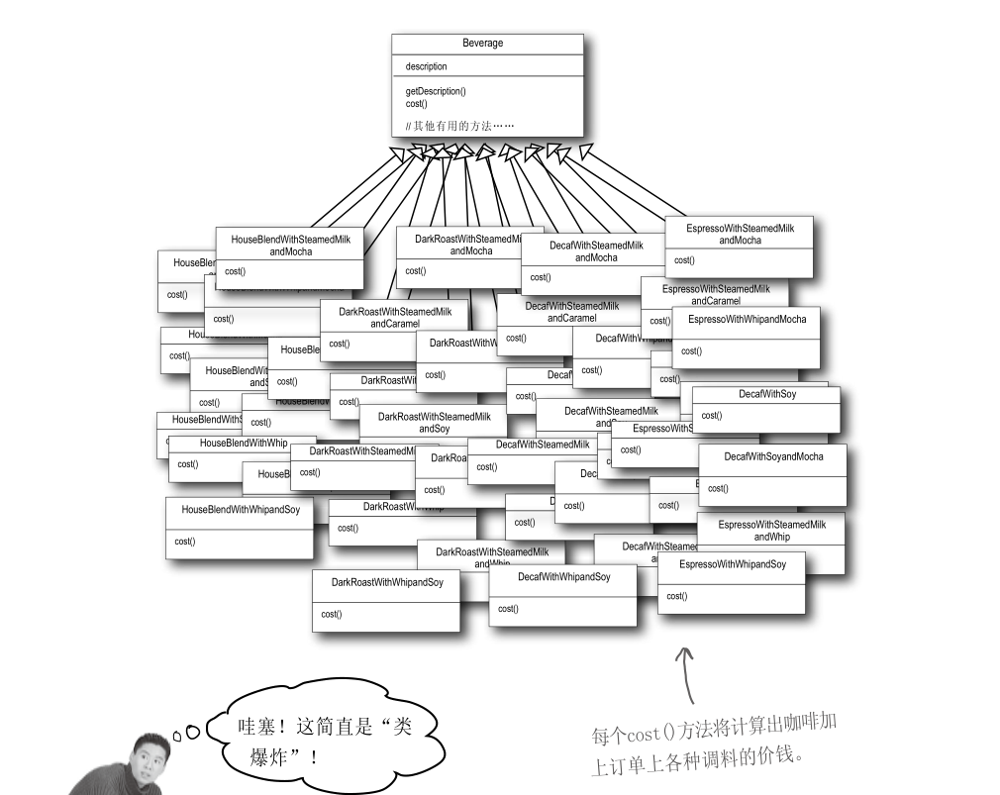


### 2.2 方案2

前面分析了方案1因为咖啡单品+调料组合会造成类的倍增，因此可以做出改进，将调料内置到Drink类中，这样就不会造成类数量过多。从而提高项目的维护性。

可以利用实例变量和继承，来追踪这些调料。

具体为：先从Beverage基类下手，加上实例变量代表是否加上调料（牛奶、豆浆、摩卡、奶泡……）

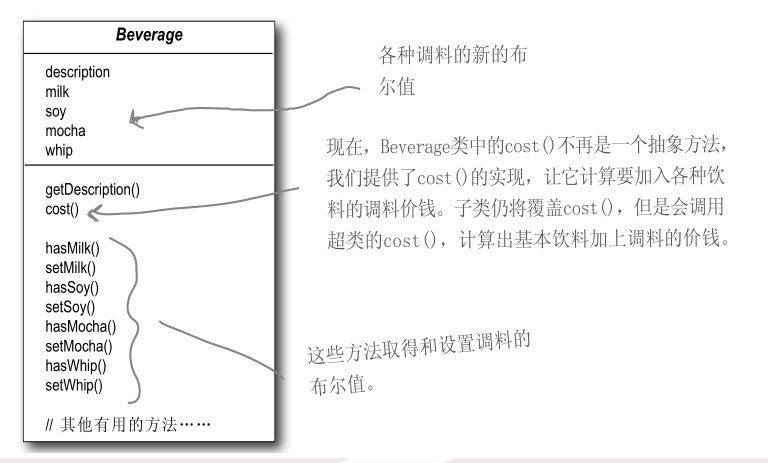

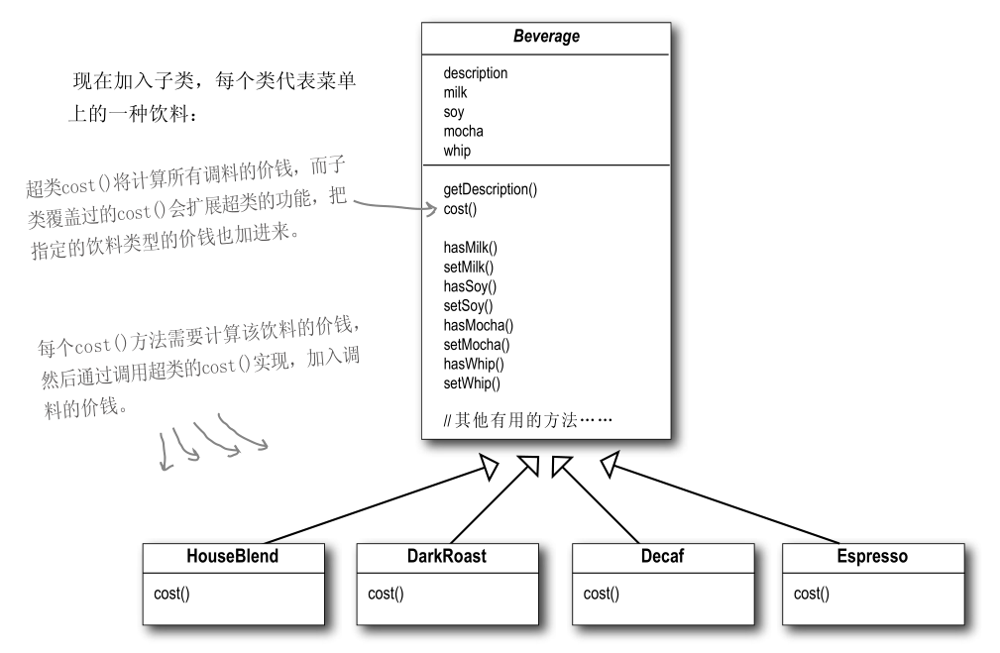

 　这种设计虽然满足了现在的需求，但是我们想一下，如果出现下面情况，我们怎么办，

　　　　①、调料价钱的改变会使我们更改现有代码。

　　　　②、一旦出现新的调料，我们就需要加上新的方法，并改变超类中的cost()方法。

　　　　③、以后可能会开发出新饮料。对这些饮料而言（例如：冰茶），某些调料可能并不适合，但是在这个设计方式中，Tea（茶）子类仍将继承那些不适合的方法，例如：hasWhip()（加奶泡）。

　　　　④、万一顾客想要双倍摩卡咖啡，怎么办？

　　很明显，上面的设计并不能够从根本上解决我们所碰到的问题。并且这种设计违反了 开放关闭原则（类应该对扩展开放，对修改关闭。）。

　　那我们怎么办呢？装饰者可以非常完美的解决以上的所有问题，让我们有一个设计非常nice的咖啡馆。


## 3. 装饰者模式定义

> 动态的将新功能附加到对象上。在对象功能扩展方面，它比继承更有弹性，装饰者模式也体现了开闭原则**(OCP**)

这里提到的动态的将新功能附加到对象和OCP原则，在后面的应用实例上会以代码的形式体现。

### 3.1 结构及原理

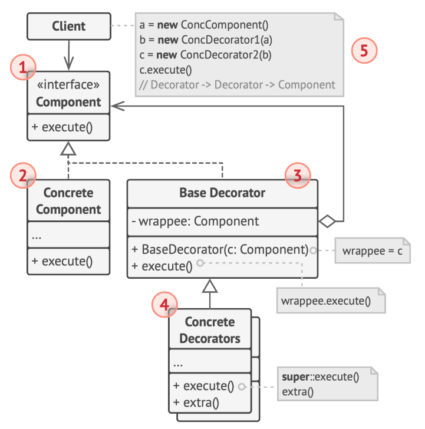

- 装饰者模式就像打包一个快递

  主体：比如：陶瓷、衣服 (Component) // 被装饰者

  包装：比如：报纸填充、塑料泡沫、纸板、木板(Decorator)

  

装饰（Decorator）模式中的角色：

* 抽象构件（Component）角 色 ：定义一个抽象接口以规范准备接收附加责任的对象。比如类似前面的 Beverage
* 具体构件（Concrete  Component）角色 ：实现组件构件接口，通常是被装饰器装饰的原始对象，也就是可以给这个对象添加职责。比如前面的单品咖啡
* 抽象装饰（Decorator）角色 ： 继承或实现抽象构件，是所有装饰器的抽象父类，并包含具体构件的实例，可以通过其子类扩展具体构件的功能。
* 具体装饰（ConcreteDecorator）角色 ：实现抽象装饰的相关方法，并给具体构件对象添加附加的责任。


## 4. 装饰者模式解决星巴克咖啡订单

　1、我们要以饮料为主体，然后在运行时以调料来“装饰”（decorate）饮料。比方说，如果顾客想要摩卡和奶泡深焙咖啡，那么，要做的是：

　　　①、拿一个深焙咖啡（DarkRoast）对象

　　　②、以摩卡（Mocha）对象装饰它

　　　③、以奶泡（Whip）对象装饰它

　　　④、调用cost()方法，并依赖委托（delegate）将调料的价钱加上去。

　　好了！但是如何“装饰”一个对象，而“委托”又要如何与此搭配使用呢？那就是把装饰者对象当成“包装者”。让我们看看这是如何工作的：

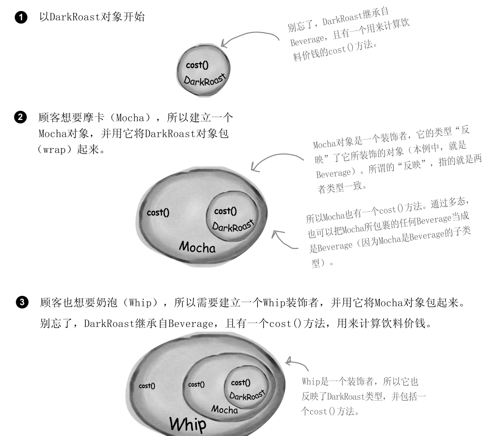

所以，被Mocha和Whip包起来的DarkRoast对象仍然是一个Beverage，任然可以具有DarkRoast的一切行为，包括调用它的cost()方法。

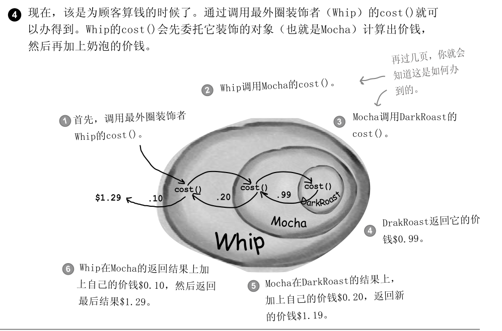

2、设计

　　我们将我们所知道的写下来：

　　　　①、装饰者和被装饰对象有相同的超类型。

　　　　②、你可以用一个或多个装饰者包装一个对象。

　　　　③、既然装饰者和被装饰对象有相同的超类型，所以在任何需要原始对象（被包装的）的场合，可以用装饰过的对象代替它。

　　　　④、装饰者可以在所委托被装饰者的行为之前与 / 或之后，加上自己的行为，以达到特定的目的。

　　　　⑤、对象可以在任何时候被装饰，所以可以在运行时动态地、不限量地用你喜欢的装饰者来装饰对象。

　　下面，我们来看一下装饰者模式的类图：

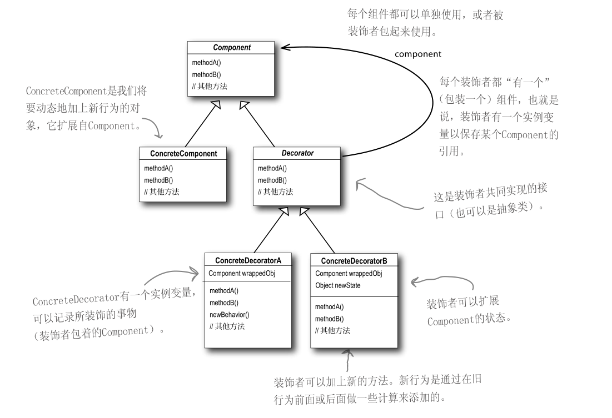

利用装饰者模式来实现我们的订单系统的类图：

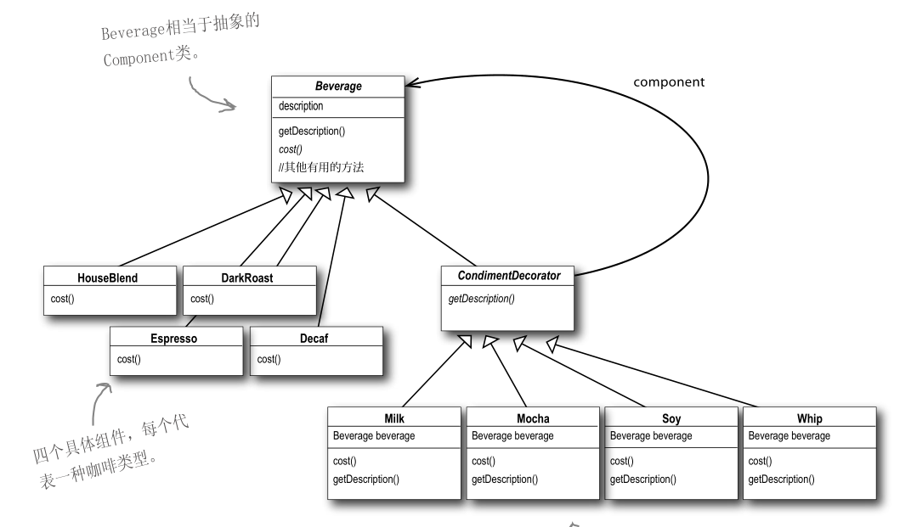

## 5.代码实现

饮料抽象类：

```java
/**
 * @description 饮料抽象类
 */
public abstract class Beverage {

    String description = "Unknown Beverage";

    public String getDescription() {
        return description;
    }

    /**
     * cost方法是用来返回饮料的价钱（需在具体类中自己实现）
     *
     * @return
     */
    public abstract BigDecimal cost();
}
```

深焙咖啡类：

```java
/**
 * 深焙咖啡类（一种具体的饮料）
 */
public class DarkRoast extends Beverage {

    /**
     * 说明他是DarkRoast饮料
     */
    public DarkRoast() {
        description = "DarkRoast";
    }

    /**
     * 实现cost方法，用来返回DarkRoast（深焙咖啡）的价格
     *
     * @return
     */
    @Override
    public BigDecimal cost() {
        return new BigDecimal("3.00");
    }
}
```

低咖啡因咖啡类：

```java
/**
 * 低咖啡因咖啡类（一种具体的饮料）
 */
public class Decaf extends Beverage {

    /**
     * 说明他是Decaf饮料
     */
    public Decaf() {
        description = "Decaf";
    }

    /**
     * 实现cost方法，用来返回Decaf（低咖啡因咖啡）的价格
     *
     * @return
     */
    @Override
    public BigDecimal cost() {
        return new BigDecimal("4.00");
    }
}
```

浓缩咖啡类：

```java
/**
 * 浓缩咖啡类（一种具体饮料）
 */
public class Espresso extends Beverage {

    /**
     * 说明他是Espresso饮料
     */
    public Espresso() {
        description = "Espresso";
    }

    /**
     * 实现cost方法，用来返回Espresso（浓缩咖啡）的价格
     *
     * @return
     */
    @Override
    public BigDecimal cost() {
        return new BigDecimal("2.00");
    }
}
```

调料装饰着抽象类：

```java
/**
 * @description 调料装饰着抽象类（继承自饮料抽象类）
 */
public abstract class CondimentDecorator extends Beverage {

    /**
     * 所有的调料装饰者都必须重新实现getDescription()方法
     * 这样才能够用递归的方式来得到所选饮料的整体描述
     *
     * @return
     */
    public abstract String getDescription();
}
```

摩卡调料类：

```java
/**
 * 摩卡调料类（继承自CondimentDecorator）
 */
public class Mocha extends CondimentDecorator {

    /**
     * 用一个实例变量记录饮料，也就是被装饰者
     */
    Beverage beverage;

    /**
     * 构造器初始化饮料变量
     *
     * @param beverage
     */
    public Mocha(Beverage beverage) {
        this.beverage = beverage;
    }

    /**
     * 在原来饮料的基础上添加上Mocha描述（原来的饮料加入Mocha调料，被Mocha调料装饰）
     *
     * @return
     */
    @Override
    public String getDescription() {
        return beverage.getDescription() + ",Mocha";
    }

    /**
     * 在原来饮料的基础上加上Mocha的价格（原来的饮料加入Mocha调料，被Mocha调料装饰）
     *
     * @return
     */
    @Override
    public BigDecimal cost() {
        return new BigDecimal("0.2").add(beverage.cost());
    }
}
```

豆浆调料类：

```java
/**
 * 豆浆调料类（继承自CondimentDecorator））
 */
public class Soy extends CondimentDecorator {

    /**
     * 用一个实例变量记录饮料，也就是被装饰者
     */
    Beverage beverage;

    /**
     * 构造器初始化饮料变量
     *
     * @param beverage
     */
    public Soy(Beverage beverage) {
        this.beverage = beverage;
    }

    /**
     * 在原来饮料的基础上添加上Soy描述（原来的饮料加入Soy调料，被Soy调料装饰）
     *
     * @return
     */
    @Override
    public String getDescription() {
        return beverage.getDescription() + ",Soy";
    }

    /**
     * 在原来饮料的基础上加上Soy的价格（原来的饮料加入Soy调料，被Soy调料装饰）
     *
     * @return
     */
    @Override
    public BigDecimal cost() {
        return new BigDecimal("0.3").add(beverage.cost());
    }
}
```

奶泡调料类：

```java
/**
 * 奶泡调料类（继承自CondimentDecorator）
 */
public class Whip extends CondimentDecorator {

    /**
     * 用一个实例变量记录饮料，也就是被装饰者
     */
    Beverage beverage;

    /**
     * 构造器初始化饮料变量
     *
     * @param beverage
     */
    public Whip(Beverage beverage) {
        this.beverage = beverage;
    }

    /**
     * 在原来饮料的基础上添加上Whip描述（原来的饮料加入Whip调料，被Whip调料装饰）
     *
     * @return
     */
    @Override
    public String getDescription() {
        return beverage.getDescription() + ",Whip";
    }

    /**
     * 在原来饮料的基础上加上Whip的价格（原来的饮料加入Whip调料，被Whip调料装饰）
     *
     * @return
     */
    @Override
    public BigDecimal cost() {
        return new BigDecimal("0.4").add(beverage.cost());
    }
}
```

咖啡馆（模拟顾客下单）：

```java
/**
 * 咖啡馆（供应咖啡）
 */
public class StarbuzzCoffee {

    public static void main(String[] args) {
        //订一杯Espresso(2.00)，不需要调料，打印出它的描述与价钱。
        Beverage beverage = new Espresso();
        System.out.println("Description: " + beverage.getDescription() + " $" + beverage.cost());

        //制造出一个DarkRoast(3.00)对象,用Mocha(0.2)装饰它,用第二个Mocha(0.2)装饰它,用Whip(0.4)装饰它，打印出它的描述与价钱。
        Beverage beverage2 = new DarkRoast();
        beverage2 = new Mocha(beverage2);
        beverage2 = new Mocha(beverage2);
        beverage2 = new Whip(beverage2);
        System.out.println("Description: " + beverage2.getDescription() + " $" + beverage2.cost());

        //再来一杯调料为豆浆(Soy 0.3)、摩卡(Mocha 0.2)、奶泡(Whip 0.4)的Decaf（低咖啡因咖啡 4.00），打印出它的描述与价钱。
        Beverage beverage3 = new Decaf();
        beverage3 = new Soy(beverage3);
        beverage3 = new Mocha(beverage3);
        beverage3 = new Whip(beverage3);
        System.out.println("Description: " + beverage3.getDescription() + " $" + beverage3.cost());
    }
}
```

运行结果：

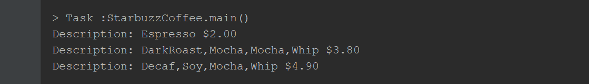

从以上，我们可以知道，当我们使用继承，导致子类膨胀，我们不想增加很多子类的情况下，将具体功能职责划分，同时继承装饰者超类，动态地给一个对象添加一些额外的职责便实现了我们的装饰者模式。


## 6. 优缺点

　1、优点：装饰类和被装饰类可以独立发展，不会相互耦合，装饰模式是继承的一个替代模式，装饰模式可以动态扩展一个实现类的功能。

　2、缺点：多层装饰比较复杂。

## 7. 使用场景

- 扩展一个类的功能。

- 动态增加功能，动态撤销。


实际使用：这里我们说一下，在java中I/O便使用了装饰者模式。

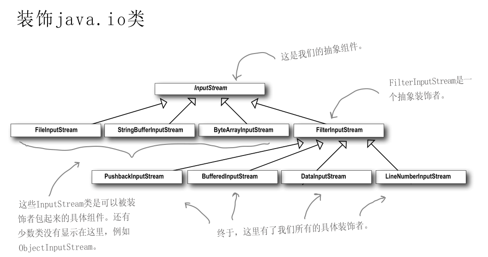

## 8.总结

- 多用组合，少用继承
- 对扩展开放，对修改关闭

