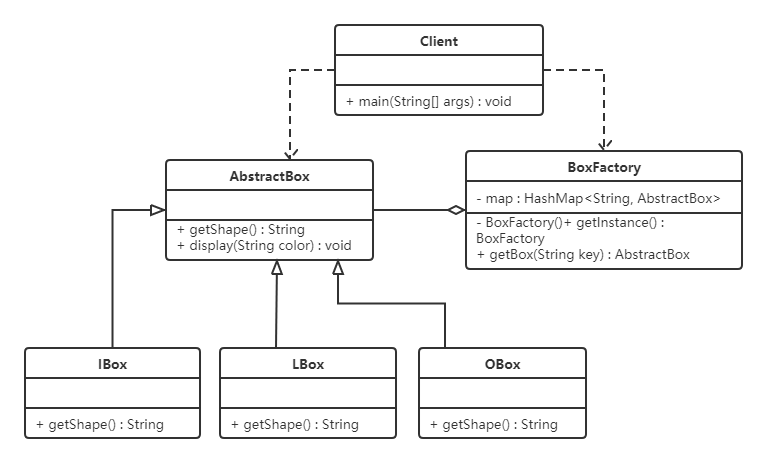

# 06-享元模式

[TOC]

## 1. 引入

小型的外包项目，给客户A做一个产品展示网站，客户A的朋友感觉效果不错，也希望做这样的产品展示网站，但是要求都有些不同:
1)有客户要求以新闻的形式发布

2)有客户人要求以博客的形式发布

3)有客户希望以微信公众号的形式发布

### 1.1 传统方式解决

1. 直接复制粘贴一份，然后根据客户不同要求，进行定制修改
2. 给每个网站租用一个空间
3. 方案设计示意图


### 1.2 传统方案解决网站展现项目-问题分析

1. 需要的网站结构相似度很高，而且都不是高访问量网站，如果分成多个虚拟空间来处理，相当于一个相同网站的实例对象很多，造成服务器的资源浪费

2. 解决思路:整合到一个网站中，共享其相关的代码和数据，对于硬盘、内存、CPU、数据库空间等服务器资源都可以达成共享，减少服务器资源

3. 对于代码来说，由于是一份实例，维护和扩展都更加容易

4. 上面的解决思路就可以使用享元模式来解决

## 2. 享元模式基本介绍

享元模式（Flyweight Pattern）也叫蝇量模式，运用共享技术来有效地支持大量细粒度对象的复用。

能够解决重复对象的内存浪费的问题，当系统中有大量相似的对象，需要缓冲池时，不需要总是创建新对象，可以从缓冲池里拿。避免大量相似类的对内存的开销，从而提高系统资源的利用率。

经典应用场景是池技术，比如String常量池，数据库连接池，缓冲池等等都是享元模式的应用，享元模式是池技术的重要实现方式。

## 3.结构

享元模式的主要角色有如下。

1. 抽象享元角色（Flyweight）：是所有的具体享元类的基类，为具体享元规范需要实现的公共接口，非享元的外部状态以参数的形式通过方法传入。
2. 具体享元（Concrete Flyweight）角色：实现抽象享元角色中所规定的接口。
3. 非享元（Unsharable Flyweight)角色：是不可以共享的外部状态，它以参数的形式注入具体享元的相关方法中。
4. 享元工厂（Flyweight Factory）角色：负责创建和管理享元角色。当客户对象请求一个享元对象时，享元工厂检査系统中是否存在符合要求的享元对象，如果存在则提供给客户；如果不存在的话，则创建一个新的享元对象。


图 1 是享元模式的结构图，其中：

- UnsharedConcreteFlyweight 是非享元角色，里面包含了非共享的外部状态信息 info；
- Flyweight 是抽象享元角色，里面包含了享元方法 operation(UnsharedConcreteFlyweight state)，非享元的外部状态以参数的形式通过该方法传入；
- ConcreteFlyweight 是具体享元角色，包含了关键字 key，它实现了抽象享元接口；
- FlyweightFactory 是享元工厂角色，它是关键字 key 来管理具体享元；
- 客户角色通过享元工厂获取具体享元，并访问具体享元的相关方法。


代码：

```java
public class FlyweightPattern {
    public static void main(String[] args) {
        FlyweightFactory factory = new FlyweightFactory();
        Flyweight f01 = factory.getFlyweight("a");
        Flyweight f02 = factory.getFlyweight("a");
        Flyweight f03 = factory.getFlyweight("a");
        Flyweight f11 = factory.getFlyweight("b");
        Flyweight f12 = factory.getFlyweight("b");
        f01.operation(new UnsharedConcreteFlyweight("第1次调用a。"));
        f02.operation(new UnsharedConcreteFlyweight("第2次调用a。"));
        f03.operation(new UnsharedConcreteFlyweight("第3次调用a。"));
        f11.operation(new UnsharedConcreteFlyweight("第1次调用b。"));
        f12.operation(new UnsharedConcreteFlyweight("第2次调用b。"));
    }
}

//非享元角色
class UnsharedConcreteFlyweight {
    private String info;

    UnsharedConcreteFlyweight(String info) {
        this.info = info;
    }

    public String getInfo() {
        return info;
    }

    public void setInfo(String info) {
        this.info = info;
    }
}

//抽象享元角色
interface Flyweight {
    public void operation(UnsharedConcreteFlyweight state);
}

//具体享元角色
class ConcreteFlyweight implements Flyweight {
    private String key;

    ConcreteFlyweight(String key) {
        this.key = key;
        System.out.println("具体享元" + key + "被创建！");
    }

    public void operation(UnsharedConcreteFlyweight outState) {
        System.out.print("具体享元" + key + "被调用，");
        System.out.println("非享元信息是:" + outState.getInfo());
    }
}

//享元工厂角色
class FlyweightFactory {
    private HashMap<String, Flyweight> flyweights = new HashMap<String, Flyweight>();

    public Flyweight getFlyweight(String key) {
        Flyweight flyweight = (Flyweight) flyweights.get(key);
        if (flyweight != null) {
            System.out.println("具体享元" + key + "已经存在，被成功获取！");
        } else {
            flyweight = new ConcreteFlyweight(key);
            flyweights.put(key, flyweight);
        }
        return flyweight;
    }
}
```

## 4.案例

【例】俄罗斯方块

下面的图片是众所周知的俄罗斯方块中的一个个方块，如果在俄罗斯方块这个游戏中，每个不同的方块都是一个实例对象，这些对象就要占用很多的内存空间，下面利用享元模式进行实现。


**先来看类图：**



**代码如下：**

俄罗斯方块有不同的形状，我们可以对这些形状向上抽取出AbstractBox，用来定义共性的属性和行为。

```java
public abstract class AbstractBox {
    public abstract String getShape();

    public void display(String color) {
        System.out.println("方块形状：" + this.getShape() + " 颜色：" + color);
    }
}
```

接下来就是定义不同的形状了，IBox类、LBox类、OBox类等。

```java
public class IBox extends AbstractBox {

    @Override
    public String getShape() {
        return "I";
    }
}

public class LBox extends AbstractBox {

    @Override
    public String getShape() {
        return "L";
    }
}

public class OBox extends AbstractBox {

    @Override
    public String getShape() {
        return "O";
    }
}
```

提供了一个工厂类（BoxFactory），用来管理享元对象（也就是AbstractBox子类对象），该工厂类对象只需要一个，所以可以使用单例模式。并给工厂类提供一个获取形状的方法。

```java
public class BoxFactory {

    private static HashMap<String, AbstractBox> map;

    private BoxFactory() {
        map = new HashMap<String, AbstractBox>();
        AbstractBox iBox = new IBox();
        AbstractBox lBox = new LBox();
        AbstractBox oBox = new OBox();
        map.put("I", iBox);
        map.put("L", lBox);
        map.put("O", oBox);
    }

    public static final BoxFactory getInstance() {
        return SingletonHolder.INSTANCE;
    }

    private static class SingletonHolder {
        private static final BoxFactory INSTANCE = new BoxFactory();
    }

    public AbstractBox getBox(String key) {
        return map.get(key);
    }
}
```


## 5. 优缺点和使用场景

**1，优点**

- 极大减少内存中相似或相同对象数量，节约系统资源，提供系统性能
- 享元模式中的外部状态相对独立，且不影响内部状态

**2，缺点：**

为了使对象可以共享，需要将享元对象的部分状态外部化，分离内部状态和外部状态，使程序逻辑复杂

**3，使用场景：**

- 一个系统有大量相同或者相似的对象，造成内存的大量耗费。
- 对象的大部分状态都可以外部化，可以将这些外部状态传入对象中。
- 在使用享元模式时需要维护一个存储享元对象的享元池，而这需要耗费一定的系统资源，因此，应当在需要多次重复使用享元对象时才值得使用享元模式。

## 6. JDK源码解析

Integer类使用了享元模式。我们先看下面的例子：

```java
public class Demo {
    public static void main(String[] args) {
        Integer i1 = 127;
        Integer i2 = 127;

        System.out.println("i1和i2对象是否是同一个对象？" + (i1 == i2));

        Integer i3 = 128;
        Integer i4 = 128;

        System.out.println("i3和i4对象是否是同一个对象？" + (i3 == i4));
    }
}
```

运行上面代码，结果如下：


为什么第一个输出语句输出的是true，第二个输出语句输出的是false？通过反编译软件进行反编译，代码如下：

```java
public class Demo {
    public static void main(String[] args) {
        Integer i1 = Integer.valueOf((int)127);
        Integer i2 Integer.valueOf((int)127);
        System.out.println((String)new StringBuilder().append((String)"i1\u548ci2\u5bf9\u8c61\u662f\u5426\u662f\u540c\u4e00\u4e2a\u5bf9\u8c61\uff1f").append((boolean)(i1 == i2)).toString());
        Integer i3 = Integer.valueOf((int)128);
        Integer i4 = Integer.valueOf((int)128);
        System.out.println((String)new StringBuilder().append((String)"i3\u548ci4\u5bf9\u8c61\u662f\u5426\u662f\u540c\u4e00\u4e2a\u5bf9\u8c61\uff1f").append((boolean)(i3 == i4)).toString());
    }
}
```

上面代码可以看到，直接给Integer类型的变量赋值基本数据类型数据的操作底层使用的是 `valueOf()` ，所以只需要看该方法即可

```java
public final class Integer extends Number implements Comparable<Integer> {
    
	public static Integer valueOf(int i) {
        if (i >= IntegerCache.low && i <= IntegerCache.high)
            return IntegerCache.cache[i + (-IntegerCache.low)];
        return new Integer(i);
    }
    
    private static class IntegerCache {
        static final int low = -128;
        static final int high;
        static final Integer cache[];

        static {
            int h = 127;
            String integerCacheHighPropValue =
                sun.misc.VM.getSavedProperty("java.lang.Integer.IntegerCache.high");
            if (integerCacheHighPropValue != null) {
                try {
                    int i = parseInt(integerCacheHighPropValue);
                    i = Math.max(i, 127);
                    // Maximum array size is Integer.MAX_VALUE
                    h = Math.min(i, Integer.MAX_VALUE - (-low) -1);
                } catch( NumberFormatException nfe) {
                }
            }
            high = h;
            cache = new Integer[(high - low) + 1];
            int j = low;
            for(int k = 0; k < cache.length; k++)
                cache[k] = new Integer(j++);
            // range [-128, 127] must be interned (JLS7 5.1.7)
            assert IntegerCache.high >= 127;
        }

        private IntegerCache() {}
    }
}
```

可以看到 `Integer` 默认先创建并缓存 `-128 ~ 127` 之间数的 `Integer` 对象，当调用 `valueOf` 时如果参数在 `-128 ~ 127` 之间则计算下标并从缓存中返回，否则创建一个新的 `Integer` 对象。

## 7.注意事项和细节

- 在享元模式这样理解，“享”就表示共享，“元”表示对象 
- 系统中有大量对象，这些对象消耗大量内存，并且对象的状态大部分可以外部化时，我们就可以考虑选用享元模式
- 用唯一标识码判断，如果在内存中有，则返回这个唯一标识码所标识的对象，用HashMap/HashTable存储4)享元模式大大减少了对象的创建，降低了程序内存的占用，提高效率
- 享元模式提高了系统的复杂度。需要分离出内部状态和外部状态，而外部状态具有固化特性，不应该随着内部状态的改变而改变，这是我们使用享元模式需要注意的地方.
- 使用享元模式时，注意划分内部状态和外部状态，并且需要有一个工厂类加以控制。
- 享元模式经典的应用场景是需要缓冲池的场景，比如String常量池、数据库连接池
