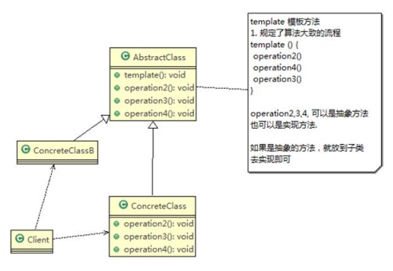
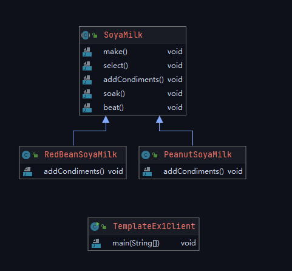

# 01-模版方法

## 场景问题

编写制作豆浆的程序，场景如下：

- 制作豆浆的流程是：选材---添加配料---浸泡---放到豆浆机打碎
- 通过添加不同的配料，可以制作出不同口味的豆浆
- 选材、浸泡和放到豆浆机打碎这几个步骤对于制作每种口味的豆浆都是一样的
- 请使用模板方法模式完成（因为模板方法模式比较简单，很容易能想到这个方案，因此就直接使用，不再使用传统的方案来引出模板方法模式）


## 模板方法模式概述

- 模板方法模式（Template Method Pattern），又叫做模板模式（Template Pattern）,在一个抽象类公开定义了执行它的方法的模板，它的子类可以按需要重写方法实现，但调用将以抽象类中定义的方式执行。
- 简单说，模板方法模式定义一个操作中的算法的骨架，而将一些步骤延迟到子类中，使得子类可以不改变一个算法的结构，就可以重定义该算法的某些特定步骤
- 模板模式属于行为型模式


## 模板方法模式原理类图

### 类图



- AbstractClass抽象类，类中实现了模板方法（template），定义了算法的骨架，具体子类需要去实现其他的抽象类方法，如operation2,3,4
- ConcreteClass实现抽象方法operation2，3，4。以完成算法中特点子类的步骤。

## 模板方法模式解决豆浆制造问题



代码实现

```java
package com.chaining.patterns.behavioral.template.ex1;

/**
 * <p>
 * 抽象类，表示豆浆
 * <p>
 *
 * @author ning.chai@foxmail.com 2021/11/08 14:44
 */
public abstract class SoyaMilk {
    /**
     * 模版方法，final修饰，不让子类去覆盖
     */
    final void make() {
        select();
        addCondiments();
        soak();
        beat();
    }

    //选材料
    void select(){
        System.out.println("第一步：选择好的新鲜黄豆");
    }

    /**
     * 添加不同的配料，抽象方法，子类具体实现
     */
    public abstract void addCondiments();

    //浸泡
    void soak(){
        System.out.println("第三步：黄豆和配料开始浸泡，需要3小时");
    }

    void beat(){
        System.out.println("第四步：黄豆和配料放到豆浆机去打碎");
    }
}

```

```java
package com.chaining.patterns.behavioral.template.ex1;

/**
 * <p>
 * description
 * <p>
 *
 * @author ning.chai@foxmail.com 2021/11/09 9:46
 */
public class RedBeanSoyaMilk extends SoyaMilk{

    /**
     * 添加不同的配料，抽象方法，子类具体实现
     */
    @Override
    public void addCondiments() {
        System.out.println("加入上好的红豆");
    }
}

```

```java
package com.chaining.patterns.behavioral.template.ex1;

/**
 * <p>
 * description
 * <p>
 *
 * @author ning.chai@foxmail.com 2021/11/09 9:58
 */
public class PeanutSoyaMilk extends SoyaMilk{

    /**
     * 添加不同的配料，抽象方法，子类具体实现
     */
    @Override
    public void addCondiments() {
        System.out.println("加入上好的花生");
    }
}

```

```java
package com.chaining.patterns.behavioral.template.ex1;

/**
 * <p>
 * description
 * <p>
 *
 * @author ning.chai@foxmail.com 2021/11/09 9:59
 */
public class TemplateEx1Client {

    public static void main(String[] args) {

        System.out.println("----制作红豆豆浆----");
        SoyaMilk redBeanSoyaMilk =  new RedBeanSoyaMilk();
        redBeanSoyaMilk.make();

        System.out.println("----制作花生豆浆----");
        SoyaMilk peanutSoyaMilk =  new PeanutSoyaMilk();
        peanutSoyaMilk.make();
    }

}

```


## 模板方法模式的钩子函数

- 在模版方法模式的父类中，我们可以定义一个方法，他默认不做任何事，子类可以视情况要不要覆盖它，该方法称为“钩子”
- 比如我们还希望制作豆浆，不添加任何的配料，请使用钩子方法对前面的模板方法进行改造

```java
package com.chaining.patterns.behavioral.template.ex1;

/**
 * <p>
 * 抽象类，表示豆浆
 * <p>
 *
 * @author ning.chai@foxmail.com 2021/11/08 14:44
 */
public abstract class SoyaMilk {
    /**
     * 模版方法，final修饰，不让子类去覆盖
     */
    final void make() {
        select();

        if(customerWantCondiments()){
            addCondiments();
        }

        soak();
        beat();
    }

    //选材料
    void select(){
        System.out.println("第一步：选择好的新鲜黄豆");
    }

    /**
     * 添加不同的配料，抽象方法，子类具体实现
     */
    public abstract void addCondiments();

    //浸泡
    void soak(){
        System.out.println("第三步：黄豆和配料开始浸泡，需要3小时");
    }

    void beat(){
        System.out.println("第四步：黄豆和配料放到豆浆机去打碎");
    }

    /**
     * 钩子方法，决定是否需要添加配料
     * @return
     */
    boolean customerWantCondiments(){
        return true;
    }
}

```


### 完善的模板方法

```java
package com.chaining.patterns.behavioral.template.ex1;

/**
 * <p>
 * 一个较为完整的模板方法定义
 * <p>
 *
 * @author ning.chai@foxmail.com 2021/10/26 16:12
 */
public abstract class AbstractTemplate {

    /**
     * 模板方法，定义算法骨架
     */
    public final void templateMethod(){

    }

    /**
     * 具体操作1，算法中的步骤，固定实现，而且子类不需要访问
     */
    private void operation1(){
        //在这里具体的实现
    }

    /**
     * 具体操作2，算法中的步骤，固定实现，子类可能需要访问
     * 不可以被覆盖，因此是final类型
     */
    protected final void operation2(){
        //在这里具体的实现
    }

    /**
     * 原语操作1，算法中的必要操作，父类无法确定如何真正实现，需要子类来实现
     */
    protected abstract void doPrimitiveOperation1();

    /**
     * 原语操作2，算法中的必要操作，父类无法确定如何真正实现，需要子类来实现
     */
    protected abstract void doPrimitiveOperation2();

    /**
     * 钩子操作，算法中的步骤，不一定需要提供默认实现
     * 由子类选择并具体实现
     */
    protected void hookOperation1(){
        //在这里具体的实现
    }

    /**
     * 工厂方法，创建某个对象，这里用Object代替了，在算法实现中可能需要
     * @return 创建的某个算法实现需要的对象
     */
    protected abstract Object creatOneObject();
}

```

> 模板方法的本质
>
> 固定算法骨架

模板方法模式主要是通过制定模板，把算法步骤固定下来，至于谁来实现，模板可以自己提供实现，也可以由子类去实现，还可以通过回调机制让其他类来实现。
通过固定算法骨架来约束子类的行为，并在特定的扩展点来让子类进行功能扩展，从而让程序既有很好的复用性，又有较好的扩展性。


## 模版方法模式的注意事项和细节

- 基本思想是：算法只存在于一个地方，也就是在父类中，基本思想是:算法只存在于一个地方，也就是在父类中，容易修改。需要修改算法时，只要修改父类的模板方法或者已经实现的某些步骤，子类就会继承这些修改
- 实现了最大化代码复用。父类的模板方法和已实现的某些步骤会被子类继承而直接使用。
- 既统一了算法，也提供了很大的灵活性。父类的模板方法确保了算法的结构保持不变，同时由子类提供部分步骤的实现。
- 该模式的不足之处:每一个不同的实现都需要一个子类实现，导致类的个数增加，使得系统更加庞大一般模板方法都加上 final关键字，防止子类重写模板方法.
- 模板方法模式使用场景:当要完成在某个过程，该过程要执行一系列步骤﹐这一系列的步骤基本相同，但其个别步骤在实现时可能不同，通常考虑用模板方法模式来处理


## 模版方法在spring框架中的应用

Spring IOC容器初始化时运用到的模板方法模式

AbstractApplicationContext
