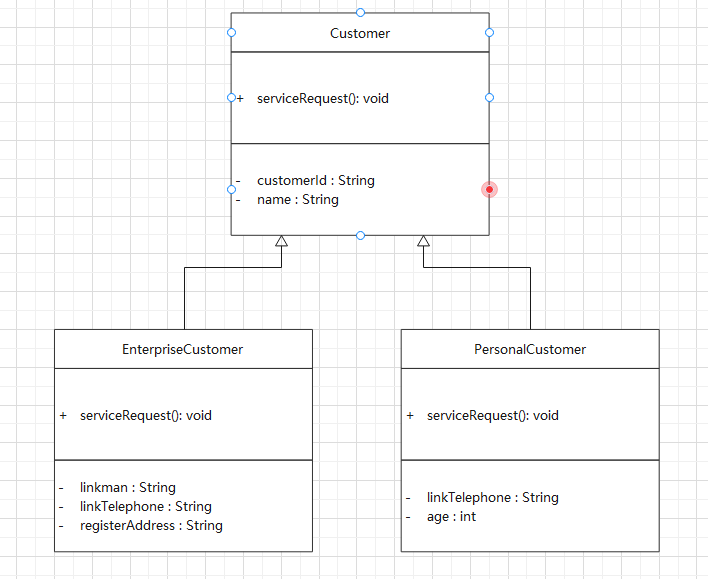

# 03-访问者模式

## 1 场景引入

### 1.1 扩展客户管理功能

既然是扩展功能，那么肯定是已经存在一定的功能了，先看看已有的功能，公司的客户分成两大类，一类是企业客户，一类是个人客户，现有的功能非常简单，就是能让客户提出服务申请。目前的程序结构如图如下：



现有的实现很简单，先看看Customer的实现，代码如下

```java
package com.chaining.patterns.behavioral.visitor.ex;

import lombok.Data;

/**
 * <p>
 * 各种客户的父类
 * <p>
 *
 * @author ning.chai@foxmail.com 2021/10/27 17:14
 */
@Data
public abstract class Customer {

    /**
     * 客户编号
     */
    private String customerId;

    /**
     * 客户名称
     */
    private String name;

    /**
     * 客户提出服务请求的方法，示意一下
     */
    public abstract void serviceRequest();
}

```

接下来看看企业客户的实现，示例代码如下：

```java
package com.chaining.patterns.behavioral.visitor.ex;

import lombok.Data;
import lombok.EqualsAndHashCode;

/**
 * <p>
 * 企业客户
 * <p>
 *
 * @author ning.chai@foxmail.com 2021/11/09 16:02
 */
@Data
@EqualsAndHashCode(callSuper = true)
public class EnterpriseCustomer extends Customer{

    /**
     * 联系人
     */
    private String linkman;


    /**
     * 联系电话
     */
    private String linkTelePhone;

    /**
     * 企业
     */
    private String registerAddress;


    /**
     * 客户提出服务请求的方法，示意一下
     */
    @Override
    public void serviceRequest() {
        System.out.println("客户 "+this.getName() + "企业提出服务请求");
    }
}

```

再来看看个人客户的实现：

```java
package com.chaining.patterns.behavioral.visitor.ex;

/**
 * <p>
 * 个人客户
 * <p>
 *
 * @author ning.chai@foxmail.com 2021/11/09 16:10
 */
public class PersonalCustomer extends Customer{

    /**
     * 联系电话
     */
    private String telephone;

    /**
     * 年龄
     */
    private int age;


    /**
     * 企业注册地址
     */
    private String registerAddress;


    /**
     * 客户提出服务请求的方法，示意一下
     */
    @Override
    public void serviceRequest() {
        System.out.println("客户 "+this.getName() + "企业提出服务请求");
    }
}

```

从上面的实现可以看出来，以前对客户的管理功能是很少的，现在随着业务的发展，需要加强对客户管理的功能。假设现在需要增加以下功能。

- 客户对公司产品的偏好分析。针对企业客尸和个入各尸有个同的才们束咕工发是根据以往购买的历史、潜在购买意问等进仃分析，对丁企业合厂心女d一户所在行业的发展趋势、客户的发展预期等分析。
- 客户价值分析。针对企业客户和个人客户，有不同的分析方式和策略。主要是根据购买的金额大小、购买的产品和服务的多少、购买的频率等进行分析。

其实除了这些功能，还有很多潜在的功能，只是现在还没有要求实现，比如，针对不同的客户进行需求调查;针对不同的客户进行满意度分析;客户消费预期分析等。虽然现在没有要求实现，但不排除今后有可能会要求实现。

### 1.2 不用模式的解决方案

要实现上面要求的功能，也不是很困难，一个很基本的思路就是，既然不同类型的客户操作是不同的，那么在不同类型的客户中分别实现这些功能就可以了。

由于这些功能的实现依附于很多其他功能的实现,或者是需要很多其他的业务数据，在示例中不太好完整地体现其功能实现，都是示意一下，因此提前说明一下。

按照上述的想法，这个时候的程序结构如图所示。

